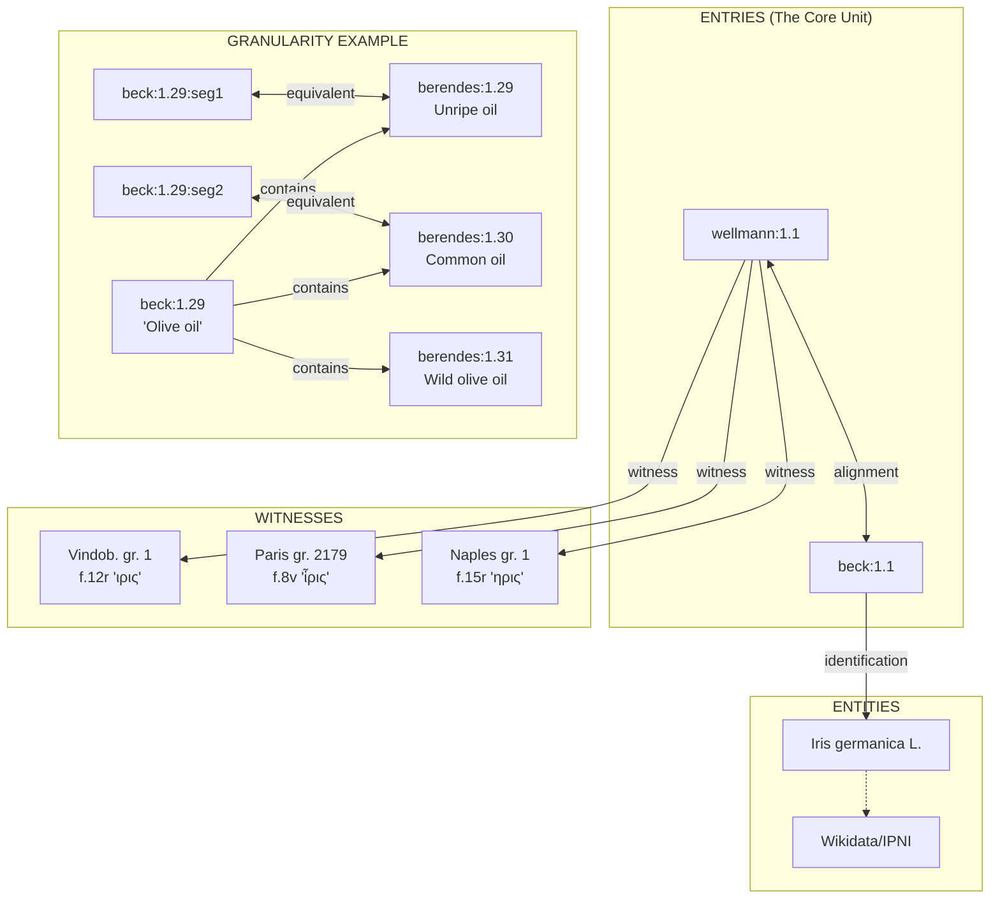

# DMM Database Normalization Plan (Revised)

## 1. Key Conceptual Model

### Entries vs. Entities
The distinction between text and reality is critical because different scholars may identify the same Greek term differently.

*   **Entry:** A textual reference in a specific edition (e.g., "ἶρις" in Wellmann 1.1, "iris" in Beck 1.1).
*   **Entity:** A botanical/natural object in the real world (e.g., *Iris germanica* L., the plant iris).
*   **Identification:** A scholarly attribution linking an **Entry** → **Entity** (e.g., "Beck identifies ἶρις as *Iris germanica* L.").

### The Granularity Problem
Different editions utilize different structural granularity.
*   *Example:* Beck 1.29 ("Olive oil") is a single chapter covering multiple oils, whereas Berendes 1.29–1.36 splits this into 8 separate chapters.

**Solution:**
1.  Use **textual segments** as the finest unit (sub-chapter).
2.  The ID system is determined **after** comparing all editions.
3.  Segments within chapters are marked with TEI `<seg>` elements.
4.  Alignments can be **chapter-to-chapter** OR **segment-to-chapter**.

---

## 2. Editions (Standardized IDs)

| ID | Name | Language | Type |
| :--- | :--- | :--- | :--- |
| `wellmann` | Wellmann (1907-1914) | grc | Critical edition |
| `sprengel` | Sprengel | grc | Critical edition |
| `desmoulins` | Desmoulins | fra | Translation |
| `matthioli` | Matthioli | lat | Commentary |
| `laguna` | Laguna | spa | Translation |
| `wechel` | Wechel | lat | Edition |
| `ruellius` | Ruellius | lat | Translation |
| `lusitanus` | Lusitanus | lat | Commentary |
| `berendes` | Berendes | deu | Translation |
| `barbaro` | Barbaro | lat | Translation |
| `beck` | Beck | eng | Translation |
| `gunther` | Gunther | eng | Translation |

---

## 3. Target Database Schema

> **Architectural Note:** There is no `substances` table. The concept of a "substance" (like iris) emerges dynamically from the alignment graph of entries across editions.

### Table 1: `editions` (Static Reference)
```sql
CREATE TABLE editions (
    id TEXT PRIMARY KEY,        -- wellmann, laguna, beck...
    name TEXT,                  -- "Wellmann (1907-1914)"
    language TEXT,              -- grc, lat, deu, eng, spa, fra
    type TEXT,                  -- critical, translation, ms, commentary
    tei_file TEXT,              -- path to TEI XML if available
    base_url TEXT               -- for external links
);
```

### Table 2: `entries` (Textual References)
```sql
CREATE TABLE entries (
    id TEXT PRIMARY KEY,        -- Format: "edition:ref[:segment]" (e.g. "berendes:1.29" or "beck:1.29:seg2")
    edition_id TEXT REFERENCES editions(id),
    ref TEXT,                   -- chapter/section ref (1.1, 1.59, 1.72...)
    segment TEXT,               -- NULL for whole chapter, or "seg1", "seg2" for sub-units
    term TEXT,                  -- the word/phrase as it appears
    term_greek TEXT,            -- Greek form if applicable
    term_latin TEXT,            -- Latin form if applicable
    page TEXT,                  -- page number in edition
    div_id TEXT,                -- div-13 etc. for TEI anchor
    seg_id TEXT,                -- seg-1 etc. for TEI segment anchor
    url TEXT,                   -- external link (Google Books, etc.)
    notes TEXT
);
```

### Table 3: `alignments` (The Graph)
```sql
CREATE TABLE alignments (
    id INTEGER PRIMARY KEY AUTOINCREMENT,
    entry_a TEXT REFERENCES entries(id),  -- e.g. "beck:1.29:seg1"
    entry_b TEXT REFERENCES entries(id),  -- e.g. "berendes:1.29"
    alignment_type TEXT,                  -- "equivalent", "contains", "part_of", "related"
    confidence TEXT,                      -- "certain", "probable", "uncertain"
    notes TEXT,
    UNIQUE(entry_a, entry_b)
);
```

### Table 4: `entities` (Botanical/Natural Objects)
```sql
CREATE TABLE entities (
    id TEXT PRIMARY KEY,        -- auto-generated or Wikidata Q-number
    type TEXT,                  -- plant, animal, mineral, preparation
    modern_name TEXT,           -- "Iris germanica L."
    wikidata_id TEXT,           -- Q12345
    wikipedia_url TEXT,
    notes TEXT
);
```

### Table 5: `identifications` (Scholarly Attributions)
*Note: The `attributed_by` field is implicit; the edition is encoded in `entry_id` (e.g., "berendes:1.29" means Berendes made this identification).*
```sql
CREATE TABLE identifications (
    id INTEGER PRIMARY KEY AUTOINCREMENT,
    entry_id TEXT REFERENCES entries(id),   -- the entry being identified
    entity_id TEXT REFERENCES entities(id), -- the botanical entity
    confidence TEXT,                        -- certain, probable, uncertain
    notes TEXT,
    UNIQUE(entry_id, entity_id)
);
```

### Table 6: `manuscripts` (Physical Witnesses)
```sql
CREATE TABLE manuscripts (
    id TEXT PRIMARY KEY,        -- vindob_gr_1, paris_gr_2179...
    name TEXT,                  -- "Codex Vindobonensis med. gr. 1"
    siglum TEXT,                -- V, P, N (critical apparatus sigla)
    repository TEXT,            -- "Österreichische Nationalbibliothek"
    shelfmark TEXT,             -- "Cod. med. gr. 1"
    date_century INTEGER,       -- 6 (for 6th century)
    iiif_manifest TEXT,         -- IIIF manifest URL
    digitization_url TEXT,      -- Link to digital facsimile
    notes TEXT
);
```

### Table 7: `witnesses` (Readings)
```sql
CREATE TABLE witnesses (
    id INTEGER PRIMARY KEY AUTOINCREMENT,
    entry_id TEXT REFERENCES entries(id),           -- links to critical edition entry (e.g., "wellmann:1.1")
    manuscript_id TEXT REFERENCES manuscripts(id),
    folio TEXT,                 -- "113r", "f.45v"
    line TEXT,                  -- line number if applicable
    reading TEXT,               -- the text as it appears in this ms
    iiif_canvas TEXT,           -- direct link to IIIF canvas
    iiif_region TEXT,           -- xywh coordinates for the passage
    apparatus_note TEXT,        -- critical apparatus info
    UNIQUE(entry_id, manuscript_id)
);
```

---

## 4. Relationships Diagram



---

## 5. CSV Data Templates

### 1. `entries.csv`
Please export page tables in this format.
*   **id:** `edition_id:ref[:segment]` (auto-generated if blank).
*   **ref:** Chapter.section as it appears in *that* edition.

```csv
id,edition_id,ref,segment,term,term_greek,page,notes
wellmann:1.1,wellmann,1.1,,ἶρις Ἰλλυρική,ἶρις Ἰλλυρική,5,
beck:1.1,beck,1.1,,iris,ἶρις,,
laguna:1.1,laguna,1.1,,lirio,ἶρις,1,
beck:1.29,beck,1.29,,Olive oil,ἔλαιον,,covers multiple oils
beck:1.29:seg1,beck,1.29,seg1,oil from unripe olives,ἔλαιον ὠμοτρίβες,,
berendes:1.29,berendes,1.29,,Öl aus unreifen Oliven,ἔλαιον ὠμοτρίβες,e-37,
```

### 2. `alignments.csv`
Types: `equivalent`, `contains` (coarse → granular), `part_of` (granular → coarse), `related`.

```csv
entry_a,entry_b,alignment_type,confidence,notes
wellmann:1.1,beck:1.1,equivalent,certain,
wellmann:1.1,laguna:1.1,equivalent,certain,
beck:1.29,berendes:1.29,contains,certain,Beck covers 1.29-1.36 in one chapter
beck:1.29:seg1,berendes:1.29,equivalent,certain,segmented alignment
```

### 3. `identifications.csv`
Maps an entry (and thus a scholar) to a botanical entity.

```csv
entry_id,entity_name,confidence,notes
beck:1.1,Iris germanica L.,certain,
berendes:1.1,Iris germanica,certain,
gunther:1.1,Iris florentina,probable,
berendes:1.29,Olea europaea (immature fruit oil),certain,
```

### 4. `witnesses.csv`
Links manuscript readings to the critical edition entry (usually Wellmann).

```csv
entry_id,manuscript_id,folio,reading,iiif_canvas,apparatus_note
wellmann:1.1,vindob_gr_1,12r,ιρις,https://iiif.onb.ac.at/.../canvas/p12,
wellmann:1.1,paris_gr_2179,8v,ἶρις,https://gallica.bnf.fr/.../f8,
wellmann:1.1,naples_gr_1,15r,ηρις,,variant spelling
```

### 5. `manuscripts.csv`

```csv
id,name,siglum,repository,shelfmark,date_century,iiif_manifest
vindob_gr_1,Codex Vindobonensis,V,Österreichische Nationalbibliothek,Cod. med. gr. 1,6,https://iiif.onb.ac.at/...
paris_gr_2179,Paris Dioscorides,P,Bibliothèque nationale de France,grec 2179,9,https://gallica.bnf.fr/...
```

---

## 6. Migration Process

### Phase 1: Extraction
1.  Parse `dioscmatmad_db.xml`.
2.  Create `entries.csv` from edition-prefixed attributes (`wm_*`, `br_*`, `bk_*`).
3.  Create initial `alignments.csv` by linking entries that share the same row in the XML.
4.  Create initial `identifications.csv` from botanical fields (`br_spec`, `gn_spec`).
5.  Create `editions.csv` with standardized metadata.

### Phase 2: Reconciliation
1.  Export manual page equivalence tables to the CSV format defined above.
2.  Merge/reconcile with extracted data.
3.  **Resolve Granularity:** Identify mismatches (e.g., Beck 1.29 vs Berendes 1.29-1.36) and decide between segmentation or one-to-many alignments.

### Phase 3: Database Generation
1.  Import all CSVs to SQLite.
2.  Validate foreign keys.
3.  Build a "Substance Cluster" view derived from the alignment graph.

---

## 7. Operational Examples

### Bulk Edit: "Shift all Laguna refs in book 1 by +13"
1.  Filter: `edition_id = laguna` AND `ref LIKE '1.%'`
2.  Apply formula: `="1." & (VALUE(MID(C2,3,10)) + 13)`
3.  Re-import CSV.

### Adding New Edition (e.g., Barbaro)
1.  Add 1 row to `editions.csv`.
2.  Add rows to `entries.csv` for every substance/chapter.
3.  Re-import.

---

## 8. Files & Dependencies

**Required Files:**
*   `scripts/migrate_db.py` (XML → CSV)
*   `scripts/import_csv.py` (CSV → SQLite)
*   `scripts/export_csv.py` (SQLite → CSV)
*   `data/*.csv` (The 6 CSV files defined above)
*   `data/dmm.db` (Final SQLite output)

**Dependencies:**
*   Python 3.8+
*   Standard Library only (`xml.etree`, `csv`, `sqlite3`). No external pip packages required.